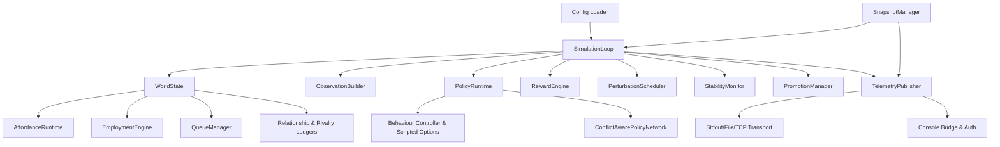

## System Architecture Overview

Townlet is organised as a simulation core with tightly-scoped service modules that expose training, telemetry, and console surfaces. The centre of the system is the tick-based simulation loop which orchestrates the world state, behavioural policy, rewards, stability monitors, and telemetry fan-out.

* `SimulationLoop` drives ticks: it seeds RNG streams, asks `PolicyRuntime` for actions, forwards them to `WorldState`, records rewards, and publishes telemetry snapshots.
* `WorldState` owns mutable state (agents, interactive objects, affordances, employment queues, relationships) and coordinates runtime sub-systems such as queue management, rivalry ledgers, and affordance execution.
* `ObservationBuilder` converts the world snapshot into feature tensors (hybrid/full variants) and manages embedding slot reuse.
* `PolicyRuntime` hosts scripted decision logic, optional PPO models, anneal blending, and rollout capture hooks.
* `RewardEngine` and `StabilityMonitor` compute per-tick metrics; `PromotionManager` evaluates release criteria against stability data.
* `TelemetryPublisher` packages tick data for streaming, processes console commands, and manages background flush threads and command audit trails.
* `SnapshotManager` persists/loads cohesive world state, telemetry, scheduler status, and RNG data for reproducible runs.

## Technology Stack

| Layer | Technology | Notes |
| --- | --- | --- |
| Language | Python ≥ 3.11 | Strict typing enabled via `mypy` (strict mode). |
| Core libraries | numpy 2.3, pydantic 2.11, pyyaml 6.0, rich 13.7, typer 0.9 | Provide numeric processing, validation, CLI UX, and config ingestion. |
| RL / Env | PettingZoo 1.24, optional PyTorch | PettingZoo integration is stubbed; PyTorch is loaded conditionally for PPO networks. |
| Tooling | pytest, mypy, ruff | Installed via `[dev]` extras for testing and linting. |
| Persistence | Local filesystem (snapshots, telemetry logs) | JSON/JSONL storage, no database. |

Upgrade considerations:
- Pinning for runtime deps is loose (lower bounds only). Introduce upper bounds or lockfiles to prevent breaking upstream releases.
- PyTorch is optional; document exact versions tested once PPO is wired up.

## Key Features & Capabilities

- Tick-based small-town simulation with affordances, employment, and rivalry mechanics.
- Policy runtime that blends scripted behaviour with PPO rollouts, including anneal and behaviour-cloning workflows.
- Observation builder supporting hybrid/full variants, social snippets, and embedding slot management.
- Telemetry publisher with buffered streaming to stdout/file/TCP, console command ingestion, and promotion guardrail metrics.
- Snapshot/restore pipeline covering world state, scheduler state, telemetry artifacts, RNG streams, and stability snapshots.
- CLI tools for simulation, replay capture, behaviour-cloning metrics, anneal rehearsals, telemetry inspection, and promotion drills.

## Data Architecture

- **WorldState**: in-memory dataclasses (`AgentSnapshot`, `InteractiveObject`, ledgers) encode agent needs, inventory, jobs, and running affordances. Queue/reservation maps and ledger structures support conflict resolution.
- **Snapshots**: `SnapshotManager` serialises world, telemetry, perturbations, stability, promotion, and RNG streams to JSON stored under configurable roots. Migration registry enforces schema evolution (current schema v1.6).
- **Telemetry**: JSON payloads flushed via buffered transports (stdout/file/TCP). Health dashboards derived from `TelemetryPublisher.latest_*` caches.
- **Training Data**: Replay datasets and BC captures are described via manifests/NPZ samples; `ReplayDatasetConfig` and `BCTrajectoryDataset` load data lazily or via streaming.
- **Embedding Allocator**: Maintains slot reuse and cooldown metadata for observation embeddings.

## API & Interface Layer

- **Console commands**: Sanitised via `ConsoleAuthenticator` tokens, routed through `ConsoleBridge` and `ConsoleRouter`. Admin commands gated by mode; snapshot operations restricted to configured roots.
- **Telemetry stream**: Exposes tick snapshots, promotion state, stability metrics, queue histories, and console results. Consumers subscribe through event subscribers or poll `TelemetryBridge`.
- **CLI scripts**: Located in `scripts/` (`run_simulation.py`, `run_training.py`, `capture_rollout.py`, etc.) and wrap loaders/harnesses.
- **Policy interfaces**: Behaviour controllers implement `decide` returning intents; PPO utilities expose standard advantage/value helpers.

## Configuration & Deployment

- Simulation YAMLs live in `configs/` (examples, affordances, perturbations, scenarios). Loader uses `pydantic` models to validate flags, reward caps, queue fairness, rivalry limits, console auth, telemetry transport, and snapshot guardrails.
- Environment variables:
  - `TOWNLET_AFFORDANCE_HOOK_MODULES`: comma-separated module list dynamically imported to register affordance hooks.
  - Console tokens can be injected via per-token `token_env` values.
- Telemetry transport options: `stdout`, `file` (ensures parent directories), `tcp` (no TLS/auth yet). Buffer thresholds configurable per config.
- No Docker or compose manifests are present; execution assumed in local virtualenv (`python -m venv .venv && source .venv/bin/activate`).
- Deployment sequence: install deps (`pip install -e .[dev]`), select config (`configs/examples/*.yml`), run CLI (`scripts/run_simulation.py` or training flow).

## Data Flow Narratives

1. **Simulation Tick**:
   - Config loader materialises `SimulationConfig` -> `SimulationLoop` seeds RNGs and constructs world/telemetry/schedulers.
   - `PolicyRuntime.decide` produces per-agent actions (scripted/PPO) -> `WorldState` applies actions, resolves affordances, updates ledgers and employment.
   - `RewardEngine` computes reward vectors; `ObservationBuilder` builds features; policy updates transitions and anneal context.
   - `TelemetryPublisher.publish_tick` captures queue metrics, rivalry snapshots, rewards, perturbations, and promotion state, enqueuing payloads for background flush.
   - `StabilityMonitor` ingests reward samples, queue metrics, embedding reuse; `PromotionManager` updates release posture.

2. **Snapshot Lifecycle**:
   - `SimulationLoop.save_snapshot` consolidates world state, telemetry caches, scheduler and promotion metadata, plus RNG streams.
   - `SimulationLoop.load_snapshot` restores via `SnapshotManager`, rehydrates world/telemetry/perturbations, and synchronises RNG streams.

3. **Training Pipeline**:
   - `run_training.py` loads config, applies PPO overrides, chooses mode (`replay`, `rollout`, `mixed`, `bc`, `anneal`).
   - Replay datasets created from manifests, capture directories, or capture buffers; PPO harness iterates batches, logging metrics via JSONL.
   - Anneal workflows compare BC baselines with PPO rollouts, updating promotion state and optionally exiting non-zero.

4. **Telemetry Transport**:
   - Buffered payloads serialised as compact JSON lines.
   - Flush thread pulls batches according to `flush_interval_ticks` or buffer thresholds, retrying on failure with exponential backoff.

5. **Console Command Flow**:
   - External caller posts command -> `TelemetryPublisher.queue_console_command` authenticates -> `WorldState` applies operations before tick -> Results recorded and broadcast via telemetry.

## Dependencies & Integration

- Internal modules are encapsulated per domain (`world`, `policy`, `telemetry`, `rewards`, `scheduler`, `snapshots`). Cross-cutting utilities include RNG state encoding and console helpers.
- External services: none presently. Telemetry expects downstream collector via stdout/file/TCP. Training harness optionally depends on PyTorch for PPO.
- Dynamic hook system imports user-provided affordance modules, enabling experimentation but requiring trust of module paths.

## Development & Operations

- **Environment setup**: create virtualenv, `pip install -e .[dev]` to install runtime plus tooling.
- **Testing**: `pytest` executes suites under `tests/` covering config loading, world mechanics, telemetry, policy harness, etc. Use markers (`@pytest.mark.slow`) to exclude heavy runs.
- **Lint & type-check**: `ruff check src tests` and `mypy src` per contributor guidelines.
- **Simulation CLI**: `python scripts/run_simulation.py --config configs/examples/base.yml --ticks 1000` (currently requires iteration of returned generator; see audit).
- **Training CLI**: `python scripts/run_training.py --config <config> [mode overrides...]` for PPO/BC workflows.
- **Telemetry inspection**: Tools in `scripts/telemetry_*` summarise captures; `observer_ui.py` seeds UI scaffolding.
- **Observability**: Telemetry health metrics include queue depth, dropped messages, perturbation counts, employment exit queue size; output stored under `logs/`.

Future operational enhancements should instrument telemetry transport TLS, automate CLI validation tests, and harden dynamic hook imports.
