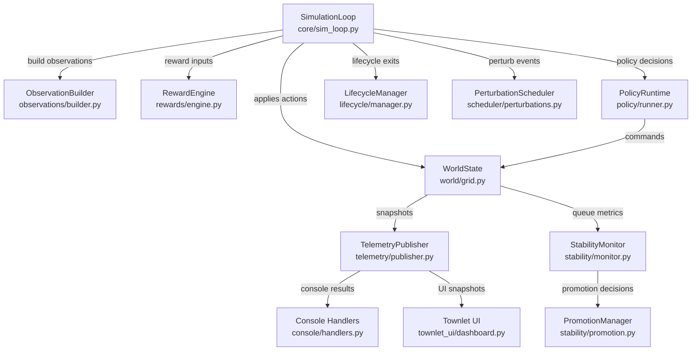

# System Documentation

## Architecture Overview
Townlet is a modular Python simulation that executes a PettingZoo-compatible town life environment. The core tick loop in `src/townlet/core/sim_loop.py` wires together world state management, agent policy execution, reward synthesis, perturbations, lifecycle checks, and telemetry publishing. Supporting subsystems in `src/townlet/world/`, `src/townlet/policy/`, `src/townlet/telemetry/`, and `src/townlet/stability/` encapsulate domain responsibilities while sharing a common configuration surface defined in `src/townlet/config/loader.py`.

The simulation loop advances ticks, drains console buffers, applies perturbations, obtains policy actions, resolves affordances, updates rewards, emits telemetry, and feeds the stability and promotion systems before repeating.

## Component Relationships
- **Core loop (`core/sim_loop.py`)** orchestrates dependencies and maintains deterministic RNG streams per subsystem.
- **World model (`world/grid.py`, `world/affordances.py`, `world/queue_manager.py`, `world/employment.py`)** manages agents, objects, affordances, queues, and economy state. Hooks and telemetry payloads are generated here.
- **Observation stack (`observations/builder.py`, `observations/embedding.py`)** reads world snapshots to produce variant-specific tensors for the policy runner.
- **Policy layer (`policy/runner.py`, `policy/behavior.py`, `policy/bc.py`, `policy/replay.py`, `policy/ppo/utils.py`)** blends scripted behaviour, behaviour cloning, and PPO rollout utilities.
- **Reward engine (`rewards/engine.py`)** translates world metrics into reward vectors and social telemetry entries.
- **Lifecycle management (`lifecycle/manager.py`)** enforces exit criteria, respawn logic, and episode bookkeeping.
- **Stability & promotion (`stability/monitor.py`, `stability/promotion.py`)** aggregates KPIs, evaluates promotion canaries, and manages rollout readiness.
- **Telemetry & console (`telemetry/publisher.py`, `telemetry/transport.py`, `console/command.py`, `console/handlers.py`, `townlet_ui/*`)** serialize observer payloads, manage command ingress, and power the Rich-based dashboard.

## Data Flow Between Services
1. **Configuration loading** – `townlet.config.load_config` parses YAML into a validated `SimulationConfig`, wiring affordances, features, telemetry, and console auth settings.
2. **World initialization** – `WorldState.from_config` provisions agents, objects, queues, and employment schedules using RNG seeds derived from config IDs.
3. **Tick execution** – `SimulationLoop.step` ( `src/townlet/core/sim_loop.py:205-276`) advances ticks, applies console operations, runs perturbations, invokes policy decisions, and resolves affordances.
4. **Observation & policy** – `ObservationBuilder.build_batch` ( `src/townlet/observations/builder.py:90-206`) encodes tensors; `PolicyRuntime` consumes them to blend scripted intent and optional neural actions.
5. **Rewards & stability** – `RewardEngine.compute` outputs reward dictionaries that feed both policy training and stability KPI tracking.
6. **Telemetry emission** – `TelemetryPublisher.publish_tick` ( `src/townlet/telemetry/publisher.py:320-452`) updates in-memory snapshots, serializes stream payloads, and forwards console command results.
7. **UI consumption** – `townlet_ui.telemetry.TelemetryClient` coerces snapshots for rendering, while `townlet_ui.dashboard` renders live panes using Rich components.

## Docker Container Architecture
No Dockerfile or compose assets ship with the repository. Deployment currently depends on a Python 3.11 virtual environment plus manual log directory provisioning. Containerization is documented as a gap (see WP-308).

## Technology Stack
- **Python 3.11** runtime with strict mypy settings.
- Core dependencies: `numpy`, `pydantic`, `pettingzoo`, `pyyaml`, `rich`, `typer` (declared in `pyproject.toml`).
- Optional dev tooling: `pytest`, `ruff`, `mypy`, `types-pyyaml`.
- UI rendered via Rich (terminal dashboard) and CLI scaffolding via Typer.
- Telemetry transport supports stdout, file, or TCP with optional TLS (`src/townlet/telemetry/transport.py`).

### Upgrade considerations
- Align `pettingzoo` and `numpy` with their latest minor versions after validating observation tensor compatibility.
- Evaluate migrating from manual threading to `asyncio` or background services for telemetry once the runtime stabilizes.
- Containerization (Docker/Podman) would simplify reproducibility and secret injection.

## Key Features & Capabilities
- Deterministic multi-agent simulation with queue fairness, rivalries, and employment loops.
- Behaviour cloning plus PPO anneal training pipelines (see `scripts/run_training.py`).
- Rich console dashboard (`src/townlet_ui/dashboard.py`) with palette command palette and telemetry overlays.
- Telemetry publishing with snapshots, streaming diffs, and console audit logs (`logs/console/commands.jsonl`).
- Promotion gating and stability monitors powering release decisions (`src/townlet/stability/*`).

## Data Architecture
- `WorldState` holds agent snapshots (`AgentSnapshot` dataclass), interactive objects, queue reservations, running affordances, employment queues, and relationship ledgers.
- Snapshots persisted via `SnapshotManager` capture RNG states, policy identity, and world data for replay/resume (`src/townlet/snapshots/state.py`).
- Telemetry payloads aggregate metrics across relationships, queues, employment, perturbations, rewards, and policy snapshots (`TelemetryPublisher._build_stream_payload`).

## API & Interface Layers
- **Console commands** – Normalized via `ConsoleCommand` and dispatched through router handlers (`src/townlet/console/handlers.py`). Responses follow `ConsoleCommandResult` schema.
- **Telemetry transport** – Configurable via `telemetry.transport` in YAML; supports stdout, file, TCP (with TLS or explicit plaintext opt-in).
- **Observer UI** – `townlet_ui.commands.ConsoleCommandExecutor` provides async command submission; `townlet_ui.dashboard.DashboardApp` renders telemetry panes.
- **CLI scripts** – `scripts/*.py` provide Typer-based entry points for simulation runs, telemetry validation, anneal rehearsals, dataset audits, and rollout capture workflows.

## Configuration & Deployment
- Primary configs live under `configs/` (examples, scenarios, affordances, perturbations). `SimulationConfig` composes feature flags, reward weights, economy, employment, telemetry, console auth, and stability settings.
- Environment variables are primarily used for console auth token injection (`console_auth.tokens.token_env`).
- Logs and snapshots default to project-relative paths (`logs/`, `snapshots/`, `tmp/`). Ensure writable directories before running long-lived sims.
- Deployment checklist:
  1. Create virtual environment and install `pip install -e .[dev]`.
  2. Select appropriate YAML config (clone `configs/examples/poc_hybrid.yaml` for custom scenarios).
  3. Configure telemetry transport and console auth, enabling TLS/auth before exposing network endpoints.
  4. Run `scripts/run_simulation.py` or orchestrate training via `scripts/run_training.py`.

## Data Flow Narratives
- **Simulation tick** – Console commands drained → scheduler injects perturbations → policy selects intents → affordances resolve → lifecycle exits & respawns → rewards generated → observations encoded → policy buffers flushed → telemetry snapshot updated.
- **Telemetry streaming** – Publisher batches JSON payloads in `TransportBuffer`; flush thread attempts delivery per tick, logging drop metrics for backpressure (`src/townlet/telemetry/publisher.py:620-699`).
- **Snapshot capture** – `SimulationLoop.save_snapshot` uses `SnapshotManager` to persist world data, RNG states, and policy identity for later restoration.
- **Training pipeline** – `TrainingHarness.run_anneal` orchestrates replay dataset ingestion, BC warm start, PPO loop, telemetry validation, and promotion checks (`scripts/run_training.py`).

## Dependencies & Integration Points
- External services limited to optional TCP telemetry sinks and future policy artifact hosting (PromotionManager expects filesystem artifacts).
- Internal integration across modules occurs through `SimulationConfig` injection, runtime context callbacks (e.g., `PolicyRuntime.register_ctx_reset_callback`), and telemetry snapshot sharing.
- Third-party integrations: PettingZoo env wrappers (policy), Rich console UI, NumPy for tensor operations, Pydantic for config validation.

## Development & Operations
- **Environment setup** – Use Python 3.11 virtualenv, install editable package with extras, and run `pytest` + `ruff` + `mypy` before commits.
- **Testing** – Comprehensive pytest suite under `tests/` covers config loading, console handlers, world behaviours, telemetry, policy training, and CLI smoke tests. CI workflow (`.github/workflows/ci.yml`) executes targeted subsets plus custom telemetry/anneal scripts.
- **Deployment** – No container; rely on scripts for running simulations/training. Promotion artifacts stored under `tmp/` and `logs/`.
- **Monitoring** – Logging via standard `logging` module; telemetry drops logged at WARN/ERROR. Stability Monitor aggregates KPIs for promotion gating but no external alerting integration yet.
- **Operational hooks** – Console audit log stored at `logs/console/commands.jsonl`; telemetry flush thread exposes status via `TelemetryPublisher.export_state()`.

